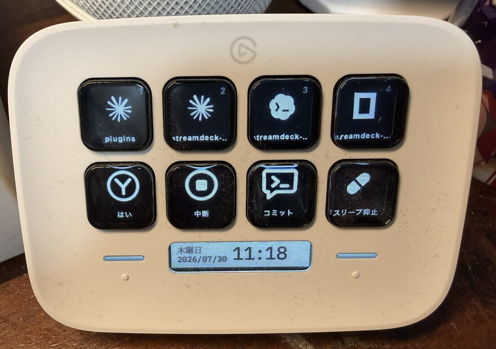

# streamdeck-herdr

Control live [Herdr](https://herdr.dev) coding agents from an Elgato Stream Deck.
The plugin shows agent state, focuses exact panes, pages across large fleets,
sends keys and saved prompts, controls pane layout, and displays live AI-provider
quota.

Agent and pane controls use Herdr's local socket API. They do not depend on
global keyboard shortcuts, terminal focus, UI scripting, browser automation,
or OpenUsage. Provider quota is a separate, optional integration.



## What this fork adds

- English and Japanese localization.
- Dynamic, shared agent pages instead of a fixed four-agent layout.
- Attention-first ordering: blocked, done, and unknown panes appear before working
  and idle panes; workspace number and pane ID provide stable tie-breakers.
- A white outline around the focused agent and automatic page following when
  Herdr focus changes.
- Larger, top-aligned workspace labels that remain readable on a desk-mounted
  Stream Deck.
- Native split, swap, close, interrupt, and prompt actions through the Herdr
  socket protocol.
- Live Claude, Codex, Antigravity, and Grok quota from OpenUsage, with provider
  icons, remaining percentage, reset time, and pool selection.
- Hardware-native attention and idle queues, workspace filtering, favorites,
  Herdr health, guarded recovery, named-session switching, prompt macros, and
  configurable terminal foregrounding.
- Ready-to-import profiles for the original 15-key Stream Deck and Stream Deck
  Neo.

## Requirements

- macOS 12 or later.
- Stream Deck software 6.4 or later.
- Herdr running on the same machine. The default socket is
  `~/.config/herdr/herdr.sock`.
- Node.js and npm for development installs.
- Optional quota dependencies described in [Quota](#quota).

When Herdr is unavailable, agent keys show a red dashed border and `×`. They
recover automatically after the Herdr socket becomes available again.

## Agent keys and paging

Each agent key shows:

- The workspace name at the top.
- A provider glyph in the center.
- Its absolute fleet slot at the lower right.
- A white outline when that pane is focused in Herdr.

Agents follow Herdr’s priority panel order—blocked, done, unknown, working,
then idle—with Herdr’s full visual pane order as the tie-breaker. A page is a window
over that one ordered fleet; it is not a Herdr workspace or tab. Pressing the
page key only browses the fleet. Press an agent key to focus that exact pane.

On macOS, an Agent key also best-effort wakes the display and activates iTerm2
after Herdr accepts the focus request. This puts the terminal running tmux/Herdr
above Stream Deck and other apps without sending keystrokes into the agent. It
also clears the configured tmux `cmatrix` lock only when that saver process is
actually running. It does not bypass a password-protected macOS lock screen;
Herdr focus still succeeds if iTerm2 is not installed or Automation permission
is unavailable.

When focus changes in Herdr—whether from the Stream Deck, terminal, or another
client—the deck opens the page containing that existing agent. A newly spawned
agent may become focused in Herdr, but does not yank the deck away from the page
you are browsing. Manual page browsing remains manual until an existing agent is
focused.

The combined page key advances on a tap and goes backward after a 600 ms hold.
The Neo profile uses separate Previous and Next keys.

### Agent-state colors

| State | Appearance | Meaning |
| --- | --- | --- |
| `idle` | Black | Waiting for input |
| `working` | Orange | Running |
| `blocked` | Red | Waiting for approval or input |
| `done` | Light blue | Finished and not yet acknowledged |
| `unknown` | Dark gray | Herdr cannot identify the agent state |
| Empty slot | Dashed border and `—` | No agent occupies this fleet slot |
| Offline | Red dashed border and `×` | The Herdr socket is unavailable |

Claude, Codex, Gemini, Cursor, and OpenCode use logo glyphs. Other harnesses
fall back to a two-letter mark. Logo paths come from
[Simple Icons](https://github.com/simple-icons/simple-icons) (CC0-1.0),
[Lobe Icons](https://github.com/lobehub/lobe-icons) (MIT), and
[Dashboard Icons](https://github.com/homarr-labs/dashboard-icons)
(Apache-2.0). Trademarks belong to their respective owners.

## Actions

| Action | Behavior |
| --- | --- |
| Agent | Show one agent's state and focus its exact Herdr pane when pressed |
| Previous Agent Page | Show the previous fleet page |
| Next Agent Page | Tap for next; hold for previous |
| Send Keys | Send approve, reject, yes, no, interrupt, or a custom key sequence |
| Send Prompt | Submit a saved prompt to the selected or focused agent |
| Split Pane | Tap to split right; hold to split down |
| Swap Pane | Tap to swap right; hold to swap down |
| Close Pane | Hold for 600 ms to close the focused pane; a tap does nothing |
| Quota | Show live provider quota; press to refresh and issue a provider-only dispatch order |
| Agent Queue | Focus the next attention-needed or idle agent; show the count |
| Agent View | Cycle Fleet, Attention, Idle, Favorites, and Workspace views |
| Workspace Page | Tap to advance workspace; hold for the previous workspace |
| Favorite | Pin or unpin the currently focused agent |
| Herdr Health | Show connection, fleet, blocked-agent, and quota health |
| Recovery | Retry, or interrupt and retry, the focused agent |
| Terminal | Bring iTerm2, Terminal, or WezTerm forward using a match |
| Herdr Session | Switch to a named Herdr session socket |

Split, Swap, Close, and manual Approve remain available in the action library
but are intentionally absent from the 15-key default profile. The default is
optimized for an auto-approve workflow: fleet navigation, one Interrupt key,
four quota keys, and Continue.

Reject and Interrupt both send Escape. They remain separate presets because
they communicate different operator intent and have different labels and
icons.

### Action targets

Actions that operate on an agent can target:

- **Focused agent** — whichever agent Herdr currently focuses.
- **Fleet index** — the Nth agent in stable fleet order.
- **Pinned session** — one persistent agent session UUID.

Prompt actions can use built-in macros for Continue, Review diff, Run tests,
Explain blocker, and Stop safely, or keep a custom prompt. Recovery is
hold-to-run and its restart mode sends Escape before the retry prompt.

Paged agent keys use fleet indexes. Other controls default to the focused
agent. Configure targeting and labels in the Stream Deck Property Inspector.

## Quota (optional)

Herdr 0.8/protocol 19 does not expose provider billing limits, percentages, or
reset windows. The core plugin therefore needs only Herdr, but real quota keys
need an external usage source. A profile with no quota actions never starts
quota polling and does not require OpenUsage or `herdr-quota`.

The quota data path is:

```text
Stream Deck plugin → herdr-quota --json → OpenUsage provider adapters
```

The plugin does not scrape provider UIs itself. It runs one shared
`herdr-quota --json` request, renders only the normalized fields it needs, and
refreshes every 60 seconds. OpenUsage provides a shared five-minute cache.
Pressing any quota key runs `herdr-quota --json --force` to bypass that cache and
sends the focused agent a standing order to spawn and delegate only to the
selected provider. It does not switch the focused pane; it tells that harness
how to spend its next round of delegated work. If the provider is unavailable,
the prompt explicitly asks the harness to report the blocker rather than fall
back silently.

Runtime dependencies:

- [OpenUsage](https://www.openusage.ai/) and its `openusage` CLI.
- The `herdr-quota` zsh helper on an executable path.
- `python3`, used by `herdr-quota` to validate and normalize OpenUsage JSON.

The plugin finds `herdr-quota` in this order:

1. `HERDR_QUOTA_BIN`
2. `~/bin/herdr-quota`
3. `/usr/local/bin/herdr-quota`
4. `/opt/homebrew/bin/herdr-quota`

Install OpenUsage on macOS with:

```zsh
brew install --cask openusage
```

Verify the complete chain before adding quota keys:

```zsh
command -v openusage herdr-quota python3
openusage --version
herdr-quota --json | jq '.providers | keys'
```

The Property Inspector supports these views:

| Provider | Pools |
| --- | --- |
| Claude | `all`, `default`, `fable` |
| Codex | `all`, `default`, `spark` |
| Antigravity | `all`, `gemini`, `nonGemini` |
| Grok | `all`, `default` |

A quota key shows `!` when the helper is missing, OpenUsage fails, or the
selected provider/pool has no usable data. A gray key means the returned data
is stale. Remaining quota uses green, amber, and red backgrounds as pressure
increases.

On the development machine used for this fork, OpenUsage, `herdr-quota`, and
Python 3 are already installed; no additional setup is needed. Most users will
not have these tools by default and can omit Quota actions entirely.

## Included profiles

### Original 15-key Stream Deck

This convenience profile is quota-enabled for the fork owner's setup. The
plugin itself does not require quota tooling; replace or remove those four
actions for a Herdr-only layout.

| Row | Keys |
| --- | --- |
| Top | Agents 1–5 |
| Middle | Agents 6–8 · Agent Page · Interrupt |
| Bottom | Claude · Codex · Antigravity · Grok · Continue |

Profile:
`com.github.yuntan.herdr.sdPlugin/profiles/herdr-original.streamDeckProfile`

### Stream Deck Neo

This profile includes one optional Codex quota key. Replace it with any Herdr
action if OpenUsage is not installed.

### Control profile

The optional control profile is designed for the original 15-key device. It
replaces quota keys with fleet controls:

```text
Agents 1–8 · Agent View · Workspace
Attention · Idle · Favorite · Health · Terminal
```

Profile:
`com.github.yuntan.herdr.sdPlugin/profiles/herdr-control.streamDeckProfile`

The quota-enabled original profile remains available for the local OpenUsage
setup. Import the control profile when fleet attention and workspace navigation
matter more than quota display.

| Row | Keys |
| --- | --- |
| Top | Agents 1–4 |
| Bottom | Previous Page · Next Page · Codex quota · Continue |

Profile:
`com.github.yuntan.herdr.sdPlugin/profiles/herdr-neo.streamDeckProfile`

Import a profile from the Stream Deck application's profile menu or open the
`.streamDeckProfile` file directly. Edit `scripts/build-profile.mjs` and run
`npm run build:profile` to regenerate both archives.

## Installation for development

```zsh
npm install
npm run build
npx streamdeck link com.github.yuntan.herdr.sdPlugin
npx streamdeck restart com.github.yuntan.herdr
```

For iterative development, run `npm run watch` alongside `npx streamdeck dev`.
Plugin logs are written under `com.github.yuntan.herdr.sdPlugin/logs/`.

## Configuration

The default Herdr socket is `~/.config/herdr/herdr.sock`. For a named session,
set the shared Socket Path in any action's Property Inspector to:

```text
~/.config/herdr/sessions/<name>/herdr.sock
```

## Development and verification

```zsh
npm test
npm run build
npm run build:profile
npm run validate
```

The protocol design is documented in
[spec/herdr-control.md](spec/herdr-control.md), and the original implementation
plan is in [tasks/plan.md](tasks/plan.md).

Herdr uses one connection per request and closes it after responding. The
plugin keeps only the event subscription alive. Agent status changes are
applied directly from `pane.agent_status_changed`; structural events trigger a
debounced `session.snapshot` refresh. High-frequency `pane.updated` events are
deliberately excluded so active agents cannot flood the plugin with redraws.
